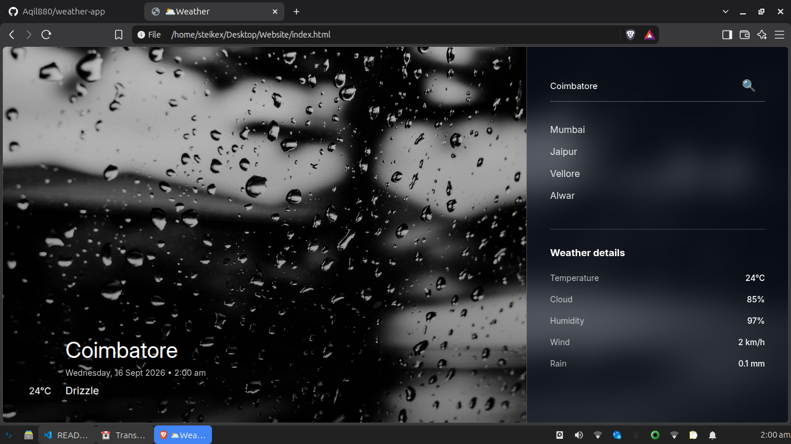

# Weather App

A simple and modern  weather application that displays current weather iinformation for a selected location

## Features

Search for a city
current temperature
relative humidity
cloud coverage
wind speed
precipitation
weather information
responsive design
glassmorphism UI

## Technologies Used 

HTML
CSS
JavaScript
Open-Meteo API

## API

this project uses the open-mteo API to retrieve weather data

## How To Run

Clone the repository: 

git clone https://github.com/Aqil880/weather-app.git

Open project folder:

cd weather-app

open index.html in your browser

Preview:

Author: Aqi880

## License

This project is licensed under the MIT License.